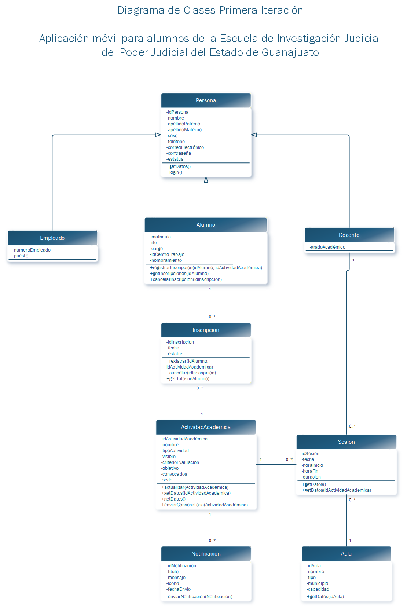

# APLICACIÓN MÓVIL PARA IOS Y ANDROID DE GESTIÓN DE ACTIVIDADES ACADÉMICAS PARA LOS ALUMNOS DE LA ESCUELA DE ESTUDIOS E INVESTIGACIÓN JUDICIAL DEL PODER JUDICIAL DEL ESTADO DE GUANAJUATO

## Descripción General

Este proyecto consiste en el modelado y estructura base de una aplicación móvil multiplataforma orientada a la gestión de actividades académicas para los usuarios de la Escuela de Estudios e Investigación Judicial del Poder Judicial del Estado de Guanajuato.

La solución está pensada para dispositivos Android e iOS, permitiendo centralizar procesos académicos como consulta de actividades, inscripciones, seguimiento, notificaciones y constancias.

---

## Objetivo del Repositorio

El presente repositorio tiene como finalidad implementar en código el diagrama de clases previamente diseñado durante la etapa de análisis y diseño de sistemas, utilizando el lenguaje Dart dentro del ecosistema Flutter.

---

## Arquitectura y Metodología Aplicada

Para la organización del proyecto se consideraron las siguientes prácticas y enfoques de desarrollo:

- **Arquitectura basada en funcionalidades (Feature Based Architecture)** para la división modular del sistema.
- **Clean Architecture** para la separación de responsabilidades en capas.
- **Programación Orientada a Objetos (POO)** para el modelado de entidades, atributos, relaciones y comportamientos del sistema.

---

## Implementación del Diagrama de Clases

Se desarrollaron las clases principales del sistema respetando la estructura del modelo UML original, incluyendo:

- Herencia entre clases (ejemplo: Persona → Alumno / Docente / Empleado).
- Asociaciones entre entidades.
- Multiplicidad entre clases (uno a uno, uno a muchos y muchos a muchos).
- Uso de clases puente, como el módulo de Inscripción.

---

## Consideraciones Importantes

Los métodos implementados dentro de cada clase representan las responsabilidades funcionales definidas en el análisis del sistema; sin embargo, en esta etapa su propósito es demostrativo y estructural, por lo que no contienen lógica operativa real ni conexión a bases de datos, APIs o servicios externos.


---

## Estado del Proyecto

Proyecto académico en fase de modelado e implementación estructural de clases.

---

## Descarga del APK

Como alternativa a la compilación del proyecto, se pone a disposición una versión instalable de la aplicación en formato APK.

Puede descargar el APK generado e instalarlo en su teléfono físico mediante el siguiente enlace:

🔗 https://drive.google.com/file/d/1EKLx_uVpWaty1RiWJ2wi_RM14F5uh8f2/view?usp=sharing

---

# Instrucciones para ejecutar el proyecto

Para la ejecución correcta del proyecto se requiere contar con el entorno de desarrollo de Flutter previamente configurado, incluyendo:

- Flutter SDK
- Android Studio o Visual Studio Code
- Extensiones necesarias para Flutter y Dart
- Un dispositivo Android físico o preferentemente un emulador Android

Se recomienda **utilizar un emulador Android** durante las pruebas y ejecución del sistema, ya que permite validar de forma más controlada funcionalidades como:

- consumo de servicios web
- navegación entre pantallas
- almacenamiento local
- notificaciones
- depuración del sistema

## 1. Clonar o descargar el proyecto

Obtener el código fuente del proyecto y abrirlo en el entorno de desarrollo seleccionado.

## 2. Instalar dependencias

Desde la terminal, ubicarse en la carpeta raíz del proyecto y ejecutar:

```bash
flutter pub get
```

Este comando descargará e instalará todas las dependencias necesarias definidas en el archivo `pubspec.yaml`, incluyendo librerías para:

- consumo de APIs institucionales
- almacenamiento local
- conectividad
- notificaciones push y locales

## 3. Verificar el entorno de Flutter

Se recomienda comprobar que el entorno esté correctamente configurado mediante:

```bash
flutter doctor
```

Este comando permitirá identificar dependencias faltantes o configuraciones pendientes.

## 4. Iniciar un emulador Android

Desde Android Studio:

- Abrir **Device Manager**
- Seleccionar un dispositivo virtual existente o crear uno nuevo
- Iniciar el emulador

También puede utilizarse un dispositivo físico Android con la depuración USB habilitada.

## 5. Ejecutar la aplicación

Con el emulador o dispositivo conectado, ejecutar:

```bash
flutter run
```

Esto compilará el proyecto e instalará la aplicación automáticamente.

---

# Instalación de la aplicación mediante APK

Como alternativa a la compilación del proyecto, puede utilizarse directamente el archivo APK disponible en el enlace proporcionado anteriormente.

Se recomienda realizar las pruebas en un **dispositivo Android físico o un emulador Android**, siendo preferible el emulador para facilitar pruebas controladas y depuración.

## Instalación en dispositivo Android físico

1. Descargar el archivo APK con nombre **app-release.apk**
2. Transferir el archivo al dispositivo móvil Android
3. Abrir el archivo APK desde el administrador de archivos del dispositivo
4. Si el sistema lo solicita, habilitar la instalación desde orígenes desconocidos o permitir la instalación de aplicaciones externas
5. Confirmar la instalación y esperar a que finalice el proceso
6. Abrir la aplicación desde el menú de aplicaciones

---

# Consideraciones adicionales

- Es necesario contar con conexión a internet para probar funcionalidades que consumen servicios institucionales
- El sistema incorpora almacenamiento local para permitir la consulta de cierta información aun sin conexión, particularmente en el módulo **Dashboard**
- Algunas funcionalidades, como las notificaciones push mediante Firebase, pueden requerir pruebas en dispositivo físico según el comportamiento del emulador
- Los botones de **Inscripción** y **Baja** son demostrativos dentro del prototipo y actualmente generan notificaciones locales para simular el comportamiento del sistema
- Para la recepción de notificaciones push mediante Firebase puede ser preferible utilizar un dispositivo físico
- Si existe una versión previa instalada, puede ser necesario desinstalarla antes de instalar la nueva versión

---

# Tecnologías utilizadas

- Flutter
- Dart
- Clean Architecture
- Firebase Cloud Messaging
- flutter_local_notifications
- sqflite
- connectivity_plus
- http
- fluttertoast

---

# Funcionalidades implementadas

## Actividades académicas
- Consulta del catálogo de actividades académicas disponibles
- Visualización de información detallada de actividades
- Simulación del proceso de inscripción mediante notificaciones locales

## Dashboard académico
- Visualización de resumen académico del usuario
- Consulta de actividades inscritas y acreditadas
- Consulta offline mediante almacenamiento local con SQLite

## Mis cursos
- Consulta de cursos inscritos
- Simulación de baja de actividades mediante notificaciones locales

## Notificaciones
- Notificaciones push mediante Firebase Cloud Messaging
- Notificaciones locales para simulación de acciones del usuario

---

## Diagrama de clases primera iteración realizado en la materia Análisis y Diseño de sistemas en el primer cuatrimestre y en el cual está basado el proyecto



---